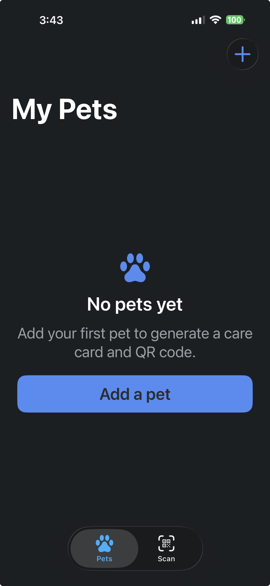
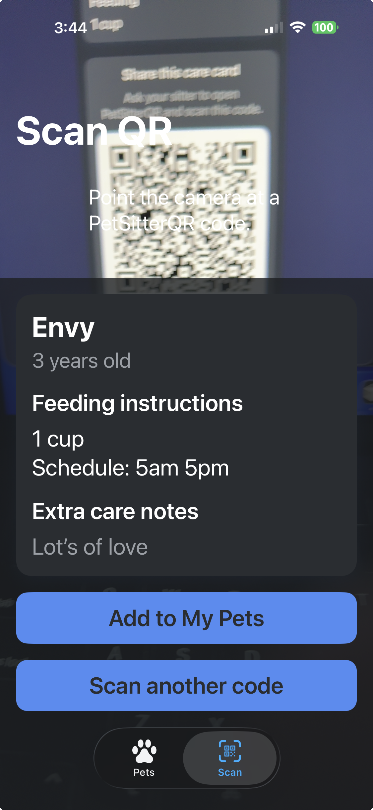
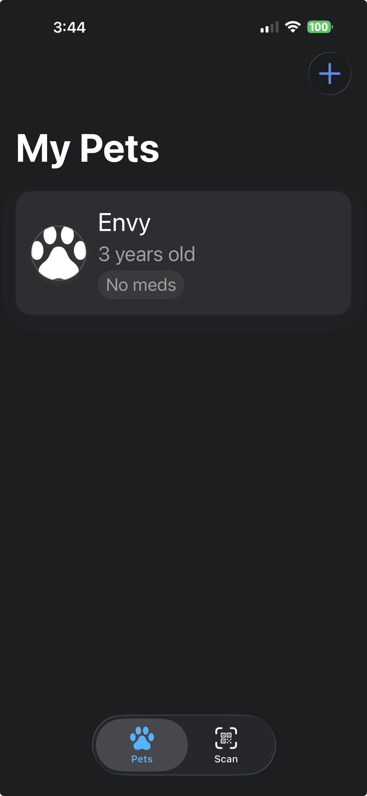
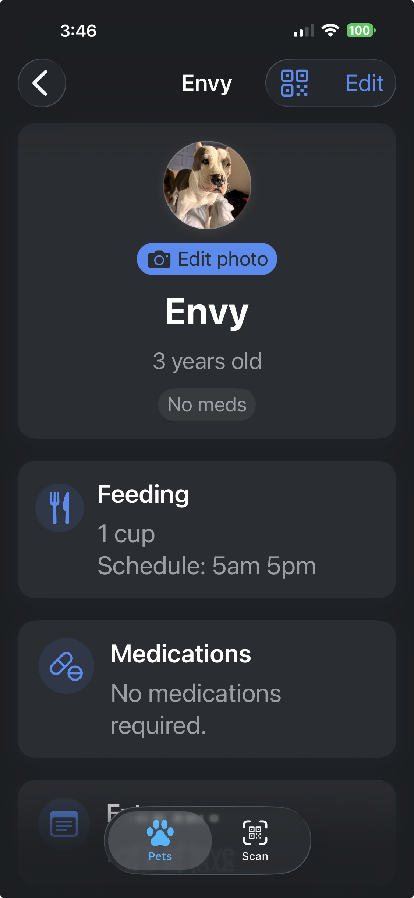
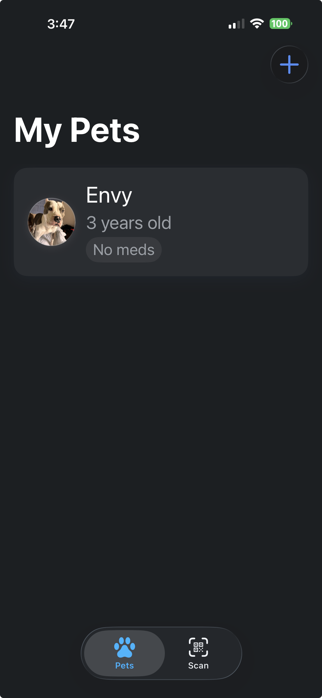
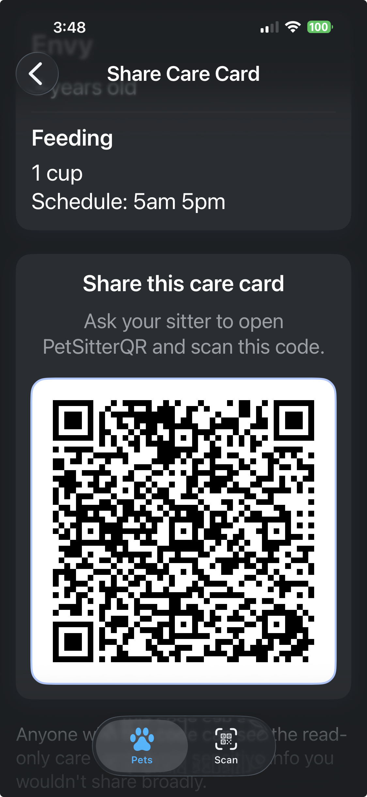

# PetSitterQR

SwiftUI + MVVM app for creating pet care cards and QR codes. Pet owners can manage pets locally (with optional photos), generate text-only QR codes, and let sitters scan them to view or import care details.

## Features
- Pet list with GlassCard design, swipe-to-delete, and programmatic navigation to detail and editor flows.
- QR generation (owner) and scanning (sitter) with text-only payloads; importing a scanned card adds the pet locally without images.
- Care detail screen with meds, feeding, and extra notes sections; optional local avatar photos stored on device.
- Local persistence via SwiftData-backed storage services.

## Project Structure
- `PetSitterQR/AppEntry/` – app wiring, shared view models.
- `PetSitterQR/Features/` – Pets, QR, and editors (views + view models).
- `PetSitterQR/DesignSystem/` – GlassCard, TagPill, SectionHeader, buttons, avatar view.
- `PetSitterQR/Services/` – storage and QR helpers.
- `PetSitterQR/Models/` – domain models and QR payloads.
- `PetSitterQR/Utilities/` – image store and helpers.

Architecture details live in `architecture.md`; design rules in `components.md` and `ui_guidelines.md`.

## Build & Run
- Open in Xcode 16+: `open PetSitterQR.xcodeproj`
- CI-friendly build: `xcodebuild -scheme PetSitterQR -destination 'platform=iOS Simulator,name=iPhone 15' build`
- Tests (when present): `xcodebuild test -scheme PetSitterQR -destination 'platform=iOS Simulator,name=iPhone 15'`
- Lint (if installed): `swiftlint`

## QR & Photos
- QR payloads are text-only per `architecture.md`; no images are encoded.
- Scanned care cards can be imported directly to My Pets; duplicate payloads are ignored.
- Pet photos are stored locally via `PetImageStore` and never leave the device.

## Screenshots

| | | |
| --- | --- | --- |
|  |  |  |
|  |  |  |

## Notes
- Set `NSPhotoLibraryUsageDescription` in Info settings for the photo picker (not modified by agents).
- Assets remain human-provided; no auto-generated additions. Use provided Brand/Neutral colors in design system components.
